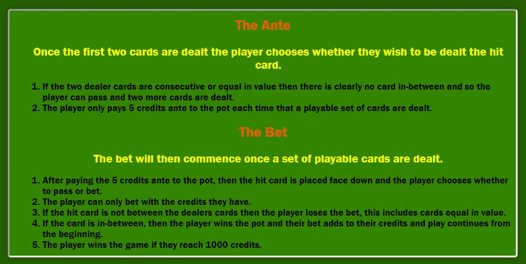

# Inbetweens -  Testing

Visit the deployed site: [Inbetweens](https://markyjay.github.io/inbetweens/)

- - -

## CONTENTS

* [AUTOMATED TESTING](#automated-testing)
  * [W3C Validator](#w3c-validator)
  * [JavaScript Validator](#javascript-validator)
  * [Python Validator](#python-validator)
  * [Lighthouse](#lighthouse)
  * [WAVE Testing](#wave-testing)
* [MANUAL TESTING](#manual-testing)
  * [Testing User Stories](#testing-user-stories)
  * [Full Testing](#full-testing)
* [BUGS](#bugs)
  * [Solved Bugs](#solved-bugs)
  * [Known Bugs](#known-bugs)

Testing was ongoing throughout the entire build. During development I made use of Google Chrome Developer Tools to ensure everything was working correctly and to assist with troubleshooting when things were not working as expected.

I have gone through each page using Google Chrome Developer Tools to ensure that each page is responsive on a variety of different screen sizes and devices.

- - -

## AUTOMATED TESTING

### W3C Validator

[W3C](https://validator.w3.org/) was used to validate the HTML on all pages of the website. It was also used to validate the CSS. I have checked the HTML via direct input and also by inspecting the page source and running this through the validator.

#### HTML
* [Index Page](https://validator.w3.org/nu/?doc=https%3A%2F%2Fmarkyjay.github.io%2Finbetweens%2F) - No errors or warnings.
* [Calculator Page](https://validator.w3.org/nu/?doc=https%3A%2F%2Fmarkyjay.github.io%2Finbetweens%2Fcalculator.html) - No errors or warnings.
* [Game Page](https://validator.w3.org/nu/?doc=https%3A%2F%2Fmarkyjay.github.io%2Finbetweens%2Finbetweens.html) - No errors or warnings.

#### CSS
* [CSS](https://jigsaw.w3.org/css-validator/validator?uri=https%3A%2F%2Fmarkyjay.github.io%2Finbetweens%2F&profile=css3svg&usermedium=all&warning=1&vextwarning=&lang=en) - No errors or warnings.
- - -

### JavaScript Validator

[jshint](https://jshint.com/) was used to validate the JavaScript. Both the script.js and calculator.js files were tested.

* [script.js](assets/documentation/testing/scriptjshintvalidation.jpg)
* [calculator.js](assets/documentation/testing/calculatorjshintvalidation.jpg)

- - -

### Lighthouse

I used Lighthouse within the Chrome Developer Tools to test the performance, accessibility, best practices and SEO of the website. These scores are somewhat lower than what I would like them to be so this is something that I would prioritise improving in the next implementation.

### Desktop Results

* [Index Page - Desktop](assets/documentation/testing/dthtmllhtesting.jpg)
* [Index Page - Phone](assets/documentation/testing/phonehtmllhtesting.jpg)
* [Calculator Page - Desktop](assets/documentation/testing/dtcalcpagelhtesting.jpg)
* [Calculator Page - Phone](assets/documentation/testing/phonecalcpagelhtesting.jpg)
* [Inbetweens Page - Desktop](assets/documentation/testing/dtgamepagelhtesting.jpg)
* [Inbetweens Page - Phone](assets/documentation/testing/phonegamepagelhtesting.jpg)

- - -

### WAVE Testing

[WAVE](http://wave.webaim.org/) (Web Accessibility Evaluation Tool) allows developers to create content that is more accessible to users with disabilities. It does this by identifying accessibility and WGAC errors.

I have used the WAVE testing tool to try and ensure there are no accessibility issues with my site.

- - -

## MANUAL TESTING

### Testing User Stories

| Goals | How are they achieved? | Image |
| :--- | :--- | :--- |
| `First Time Visitors` |
|  |  |  |
| Navigation | A navigation bar giving acces to the game and the probability calculator. ||
| Central image clear access to the game | A hover function on the inbetween card is applied so the user is directed to the game with ease. ||
| Description | Description of what the site is about is included on the home page. ||
| Clear and accessible instructions | The game objective and ranking of cards as well as an ante and betting explanation is inculded. ||
| Ante and betting instructions to the game | A section dedicated to the explanation of ante and betting system ||
| Play game | The user can go directly to game and start playing ||
|`Returning Visitors`|
|  |  |  |
| Visitors to the site can try the probability calculator to improve their betting techniques. |Have fun guessing the probability of random cards||
| Three scenarios | A section dedicated to showing three scenarios to help user understand the how to win |  |
|`Admin User` |
|  |  |  |
| Apply maintenance and fixes to the site in future iterations | Due to time constraints, and as i am new to JavaScript there are idea i wish to implement in the future to make the game more enjoyable and information more accessible|  |

- - -

### Full Testing

Full testing was performed on the following devices:

* Desktop:
  * Windows 27inch screen

* Mobile Devices:
  * Huawei p20 pro.
  * iPhone 11 pro.

Each device tested the site using the following browsers:

* Google Chrome
* Firefox

| Feature | Expected Outcome | Testing Performed | Result | Pass/Fail |
| --- | --- | --- | --- | --- |
| `Navbar` |
|  |  |  |  |  |
| Home page | When home page is clicked the user will be redirected to the home page. | Clicked link | Redirected to the game page. | Pass |
| Calculator Page | When calculator page is clicked the user will be redirected to the calculator page.| Clicked link | Redirected to the calculator page. | Pass |
| Inbetweens Link | When clicked the user will be redirected to the game page. | Clicked link | Redirected to the game page. | Pass |
| `Footer` |
|  |  |  |  |  |
| Github link | When clicked the user will be redirected to the admin github page. | Clicked icon | Redirected to github page. | Pass |
| LinkedIn link | When clicked the user will be redirected to admin LinkedIn profile page. | Clicked icon | Redirected to the profile page. | Pass |
| `Home Page` |
|   |   |   |   |
| Inbetweens Heading | When central image is clicked the user will be redirected to the home page. | Clicked image | Redirected to the game page. | Pass |
| `Calculator Page` |
| Inbetweens Heading | When central image is clicked the user will be redirected to the home page. | Clicked image | Redirected to the game page. | Pass |
| Calculator button | When the Calculate Probability button is pressed the dealer cards generate randomly a provide a probability modal | Probaility modal works, probability calculation not accurate. | Somewhat accurate probability given |  Pass |
| `Game Page` |
| | | | | | |
| Deal Button | The deal button generates and displays two random dealer cards | Pressed dealer button hundreds of times in testing | Ran console log on JavaScript and watched the function generate random cards | Pass |
| Hit Button | The hit button generates and displays a random player cards | Pressed hit button hundreds of times in testing | Ran console log on JavaScript and watched the function generate random card each time | Pass |
| Pass Button | The pass button generates and displays two random dealer cards | Pressed pass button hundreds of times in testing | Ran console log on JavaScript and watched the function generate random cards | Pass|
| Bet-Up Button | The bet-up button increases bet by 5 | Pressed bet-up button hundreds of times in testing | Ran console log on JavaScript and watched the function add to the betting total | Pass |
| Bet-Down Button | The bet-down button decreases bet by 5 | Pressed bet-down button hundreds of times in testing | Ran console log on JavaScript and watched the function subtract from the betting total | Pass |
| Reset Button | The reset button refresshes and displays the back image on dealer and player cards | Pressed reset button multiple times in testing | Ran console log on JavaScript and watched the function reset cards | Pass |

 - - -

## BUGS

### Solved Bugs

| No | Bug | How I solved the issue |
| :--- | :--- | :--- |
| 1 | Array issues | I constructed 2 arrays. One containing the four suits and another containing the numbers 1 - 13. Then designed a function called getRandomCard () that returned a random suit with a random value. I later recognised three major issues.|
|1(a)|The getRandomCard function was returning a set value that was not recognisable as a number that the checkResult function could use. | I created a method to define the cards chosen by the getRandomCard function to be a substring and removing the last part of the string which would be the suits symbols. This provided clear values that could be properly used to calculate the result of inbetween cards.
|1(b)|The rule that a black ace and a red ace had different values caused serious issues and headaches and initially i considered removing the rule but i persevered and designed a solution i believe to be quite clever.| I added a 14th value to the array and defined the red cards to be designated by 2 to 14 allowing the red aces to have a substring value of 14 and alternatively the black cards were designated the values of 1 to 13 so that a black ace had the substring value of 1. Now when the check result calculation was done the cards all had the same values despite their suit but black and red aces had a low and high value respectivley.
|1(c)|This created a secondary issue whereby there was extra values in the group that the getRandomCard could choose from. (four extra cards that needed to be removed to provide a full deck of 52 cards and not 56)|This secondary issue i solved by using a filter that removed the four unwanted values (the two high value black aces (14 of clubs & 14 of spades) and the two low value red aces (1 of hearts & 1 of diamonds))|

- - -

### Known Bugs

| No | Bug | |
| :--- | :--- | :--- |
| 1 | The cards sometimes take time to appear.  |This is a rendering issue |
| 2 | The pass button can be activated multiple times it only supposed to generate two new cards without charging the player extra in the case of the cards being consecutive or the same.|I tried to fix this like i did with the hit button by disabling the button but it caused issues as it can happen that the pass button may need to be pressed a few times if the cards happen to be unplayable. |
| 3 | The probability calculator does not calculate precisely. | This is due to the fact that the function calculate the probabilty of the value of card3 being in between the value of card1 and card2 but does not filter out card1 and card2 when calculating. If i had more time i would look in to this and likely implement a solution in a future iteration |
| 4 | I tried to implement a high score feature. | I had a very difficult time understanding how to implement this feature using javaScript, any solutions found online did not help me understand how to incorporate it into my project. I attempted it but ran out of time and hope to implement this after i gain more understanding. Other languages like bootstrap may help me implement it in future iterations. |
