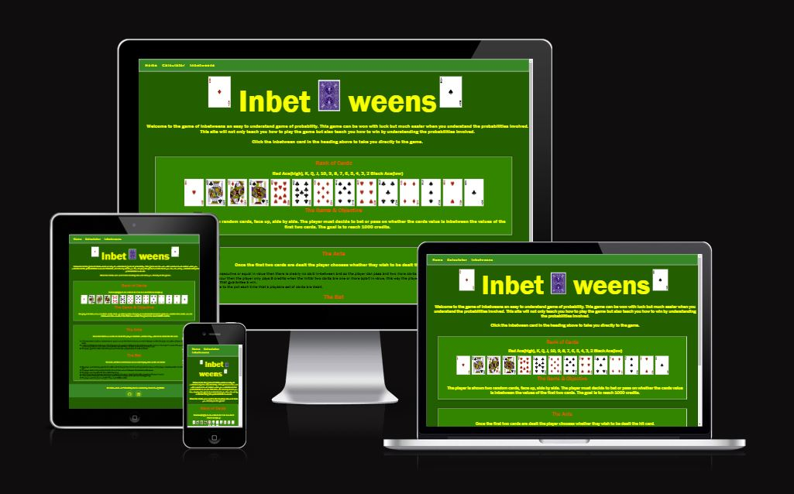
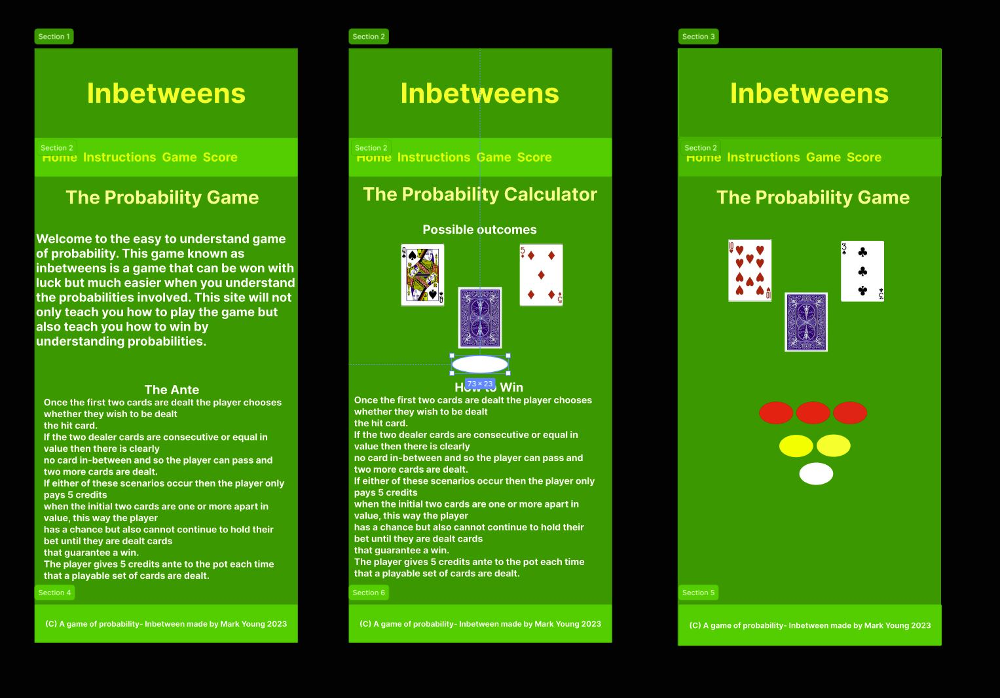
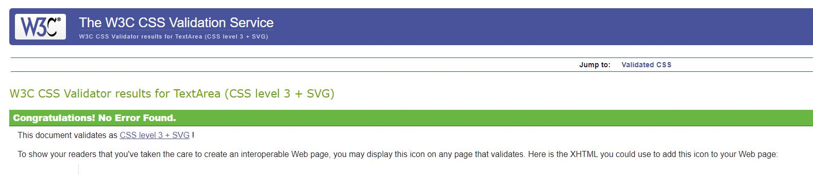

# Inbetweens Card Game

Welcome to Inbetweens the Card Game! Test your luck by placing bets on whether the next card will be "inbetween"

Inbetween is a card game I played as a teenager, it’s a betting game usually played for money. The game will be adapted for the purposes of this project. In later years as a teacher I adapted games like this to help my students to understand the concept of probability and chance and they found it very enjoyable and learned quickly to ascertain high and low probabilities and the highs and lows of risk-taking. 

A live version of the site can be found here: https://markyjay.github.io/inbetweens/

# Table of contents

- [UX](#ux "UX")
  - [User Demographic](#user-demographic "User Demographic")
  - [User Goals](#user-goals "User Goals")
  - [Design](#design "Design")
  - [Colour Scheme](#colour-scheme "Colour Scheme")
  - [Typography](#typography "Typography")
  - [Images](#images "Images")
- [Features](#features "Features")
  - [Header & Logo](#header-&-logo "Header & Logo")
  - [Navigation Bar](#navigation-bar "Navigation Bar")
  - [Main Image](#Main-image "Main Image")
  - [Main Section](#main-section "Main Section")
  - [Calculator Page](#Calculator "Calculator Page")
  - [Game Page](#game "Game Page")
  - [Inbetweens - The Game](#the-game "The Game")
    - [Rank Of Cards](#rank-of-cards "Rank of Cards")
    - [Game Objective](#game-objective "Game Objective")
    - [The Ante](#the-ante "The Ante")
    - [The Bet](#the-bet "The Bet")
    - [Adaptations for project purposes](#adaptations-for-project-purposes "Adaptations for project purposes")
  - [Footer](#footer "Footer")
- [Technologies Used](#technologies-used "Technologies Used")
- [Testing](#testing "Testing")
  - [Validator testing](#validator-testing "Validator Testing")
  - [Testing and bugs](#testing-and-bugs "Testing and bugs")
- [Deployment](#deployment "Deployment")
- [Media](#media "Media")
- [Other Sources](#other-sources "Other Sources")
- [Acknowledgements](#acknowledgements "Acknowledgements")

## User Experience

### User stories

* As a user, I want an introduction to the game with a casino style environment.
* As a user, I want to have easy access to play the game directly from the home page.
* As a user, I want a clear account of the rules and objectives of the game.
* As a user, I want notifications of wins and losses throughout the gameplay.
* As a user, I want to be able to easily access the game instructions in case I forget how the game works.
* As a user, I want to be able to reset the game so i can play again.

### User Demographic
The game is aimed toward people who like to play card games and teachers who would like to use a game to help their students understand the concept of probability and chance variations through a simple game using cards.
The game is simple, fast and designed to be engaging. The game involes gambling but offers no risk as it does not use money, the player converts one hundred credits in to 1000 credits to accomplish a win.  

### User Goals
The goal is to create a website that is Informational, enjoyable and challenging. The website takes a commonly known card game to teach chance and probability to students and for any user to have fun while challenging themselves to reach the winning objective of 1000 credits.

### Design
The concept started as a practice project so that i could learn javaScript and in the process i came to realise that although it was a basic game it's rules provided many intricate details that really challenge my understanding of code. It begain with the game only, three cards and buttons to initiate the deal, the bet and a reset. After about two weeks of painstaking learning i realised that i had spent so much time trying to work out the intricacies that i would finish it a submit it for my second project for the Code Institute.

At this point i designed the rest of the site on figma.com and decided to make it a learning site for probability, as i am a maths teacher I felt it appropriate.

Figma Design 

Favicon https://www.favicon.cc/?action=icon&file_id=761394

### Color Scheme
The colour scheme is various shades of green to depict the felt of casino tables and yellow and orange text to stand out clear from the background. There are also grey borders surrounding the cards and  

### Typography

font-family: "Franklin Gothic Medium", "Arial Narrow", Arial, sans-serif;

### Images

The pictures of cards were downloaded from https://bicyclecards.com/

## Features

Home page introducing the game with a section for the game objective, the ante and the bet. A page dedicated to showing the probability of inbetween cards, and a page where the user can take part in the game and attempt to achieve 1000 credits.

### Header & Logo
The header plays on the word itself, placing the card between the games heading. The card in between has a href function that takes the user directly to the game. Otherwise they can use the navigation bar to go to the game itself.

### Navigation bar
I kept the navigation bar basic to stick with the retro theme of a casino style card site. 

### Main Section

### Calculator Page
This page is dedicated toward learning about the probability of a win or loss.

### Game Page

#### The Game
The dealer lays two random cards face up side by side and in front of the player, so both dealer and player can see the value of each card, a third card is then laid face down in-between these cards and play begins.
#### Rank of Cards
Red Ace (High), K, Q, J, 10, 9, 8, 7, 6, 5, 4, 3, 2, Black Ace (Low)
#### Game objective
To reach 1000 credits.
#### The Ante
Once the first two cards are dealt the player chooses whether they wish to be dealt the hit card. For example, if the first two cards are consecutive then there is no card in-between and so the player passes and two more cards are dealt, the same if the first two cards are equal in value. For this reason the player pays 5 credits only when the initial two cards are one or more values apart, this way the player has a chance but also cannot continue to hold their bet until they are dealt cards that guarantee a win. In short, the player pays 5 credits ante to the pot each time that a playable set of cards are dealt.

#### The Bet
The bet will then commence once a set of playable cards are dealt and the player puts 5 credits to the pot, then the hit card is placed face down and the player chooses whether to either pass, double, triple, quadruple etc players bet on the premise that the hit card value is in-between the dealer cards values. The player can only bet with the credits they have.

If the hit card is not between the dealers cards then the player loses the bet. If the hit card is the same value as either of the dealers cards then again the player loses the bet as it is not in-between. If the card is in-between, then the player wins the pot and play continues from the beginning. The player wins the game outright if they reach 1000 credits.

#### Adaptations for project purposes
1.	The game can be played with multiple players but as this is my first time creating a game using JavaScript I will keep it to a single player and the dealer. It may be something to expand upon once I improve my skills in coding. 
2.	The winner is usually the player with the most amount of chips at the end of the game or the game can end when the player loses everything to the dealer.
3.	If the two dealer cards that are laid are consecutive then the dealer must lay two new cards as the player has zero chance of a card being inbetween. If the dealer cards are the same in value then the player can say "split" and the dealer must lay a card on the first card on which the player can choose to bet or pass, and then lay another card on the second card where the player can choose to bet or pass. (This rule will be removed due to technical difficulties but may be able to be applied in future iterations of the game) 
4.	The betting is usually done by choosing a specific amount to bet, if the player gets a red ace and a black ace they usually bet the pot as it’s the highest chance of a win. If either of the remaining aces are played for their hit card they lose and so lose the amount of credits equal to the pot. If the card is inbetween the aces then the player wins everything in the pot.

### Footer
The footer contains the copyright logo, with a sentance "A Probability game : Inbetweens by Mark Young 2023"
Also contained in the footer are href access to my linkedIn and Github account.

## Technologies Used

- HTML
- CSS
- JavaScript

## Testing

### Validator testing
Validator.nu/LV http://validator.w3.org/services
-HTML5
  - No errors were found using W3C HTML validator testing. 
 

-	CSS3
  - No errors were found using W3C HTML validator testing.

- JavaScript
 - No errors were found using JSHint validator testing

 

### Lighthouse testing

As I progress through the course i hope to learn more about HTML and CSS code to imrove the results of my lighthouse testing.

## Bugs & Errors

1.
2.  

## Deployment

The development platform used for this project was GitPod. To track the development stage and handle version control regular commits and pushes to GitHub has been conducted. The GitPod environment was created using a template provided by Code Institute.
The live version of the project is deployed at GitHub pages.
The procedure for deployment followed the "Creating your site" steps provided in GitHub Docs.
* Log into Github. 
* Select the correct GitHub Repository to be deployed live.
* Underneath the repository name, click the "Settings" option.
* In the sub-section list on the left, under "Pages".
* Within the "Source" section choose "main" as Branch and "root" as folder and click "Save".
* The page refreshes and a website shall then deploy via a link.

The live deployed link can be found here : https://markyjay.github.io/inbetweens/

## Media Sources

* Site Design
The site application Figma was used to portray an overall image of the project beforehand.
https://www.figma.com/

* Color Pallete
Basic green for the background with various shades, yellow, red and black for the writing.

* Font styling
The following site was used to generate a good combination of font that worked well with the theme of the site.

https://cdnjs.com/libraries/font-awesome

* Logo Design
I decided to input the well known backing of a Bicyle playing card. The image was taken from the official site.

https://www.bicycle.com/

* Responsivity

This site was recommended by code institute and used to portray the responsivity of the project. 

https://ui.dev/amiresponsive

## Other Sources

* Learning CSS Grid
To learn CCS grid these sites were utilised.
https://www.w3schools.com/css/css_grid.asp
https://codepen.io/waffleknit/pen/KJEpLp
https://www.youtube.com/playlist?list=PL4cUxeGkcC9itC4TxYMzFCfveyutyPOCY

* Learning JavaScript
To learn the various methods of JavaScript these sites were utilized.
https://www.w3schools.com/js/default.asp
https://pythontutor.com/
https://exercism.org/

* Error research
To fix errors in my code i utilised sites such as
https://stackoverflow.com/
https://www.youtube.com/
https://www.w3schools.com/
slack

## Acknowledgements
For inpiration in general, for code, design help and advice, I'd like to give thanks to; 

- Jubril my mentor at Code Institute who was very patient and generous with his time.

- Kyle Clow, Stephen Dawson and Jody Murray fellow students I met during hackathons. They helped me kindly and patiently with advice and encouragement.

- Patricia Young my mother who has been encouraging and patient with me throughout the project.

- Slack members and the code institute tutoring service were also helpful throughout the project.

